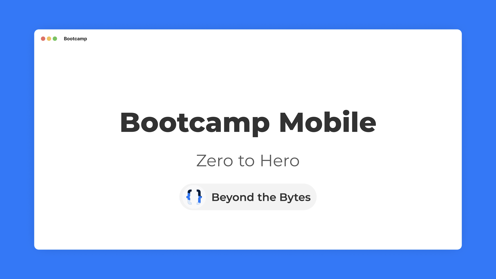

# Bootcamp-Mobile
**Zero to Hero:** aprenda Flutter do zero com um projeto em paralelo.


<br/>

## Commandos de Flutter
```sh
flutter pub get # downloading dependencies
flutter run # running the app
```
<br/>

## Sobre o autor
- **Luca Dillenburg - [Beyond the Bytes](https://www.linkedin.com/company/beyond-the-bytes/)**
<details>
    <summary><b>Beyond the Bytes:</b> Design & Desenvolvimento de Software</summary>
    
</details>
